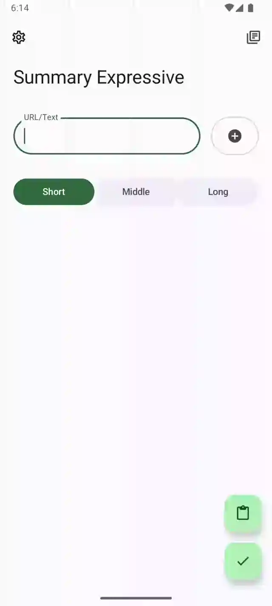

# Summary Expressive

Summarize YouTube-Videos, Articles, Images and Documents with AI

[MAD](https://developer.android.com/courses/pathways/android-architecture): Kotlin + Jetpack
Compose + M3 Expressive

## 📱 Screenshots

## 🔗 Download

### Github Release

There are 2 releases available:

- **standalone** which
  includes [ML model](https://developers.google.com/ml-kit/vision/text-recognition/v2) to recognize
  text from image, it got larger package size.

- **gms** which allows user to download the model from Google Play Services, but GMS required.

### Play Store (coming soon)

The Play Store release bundled with gms version. This package is signed by Google managed key for
simplicity, which means it's not compatible to update in Google Play Store if you installed a github
package previously.

## 📖 Features

- Summarize multiple media types

| media       | supported types                        |
|-------------|----------------------------------------|
| Video(link) | Youtube, BiliBili(Planed)              |
| Document    | MS Word, PDF(very long content planed) |
| Image       | Jpg, Png, Webp (Latin only for now)    |
| Text        | Article link, Plain text               |

- Multiple LLM models supported

| provider    | models |
|-------------|--------|
| OpenAI      | TBD    |
| Gemini      | TBD    |
| Gemini nano | Planed |
| Claude      | Planed |

- [Material 3 Expressive](https://m3.material.io/blog/building-with-m3-expressive) style UI, with
  dynamic color theme.

- Instant summarize via share sheet or text selection toolbar

- Configurable summary length

- Read-Out the summaries

- History search

## 🌟 Credits

- The [original idea](https://github.com/talosross/SummaryYou)
  from [talosross](https://github.com/talosross)

- [Koog](https://koog.ai) for kotlin-based LLM interactions